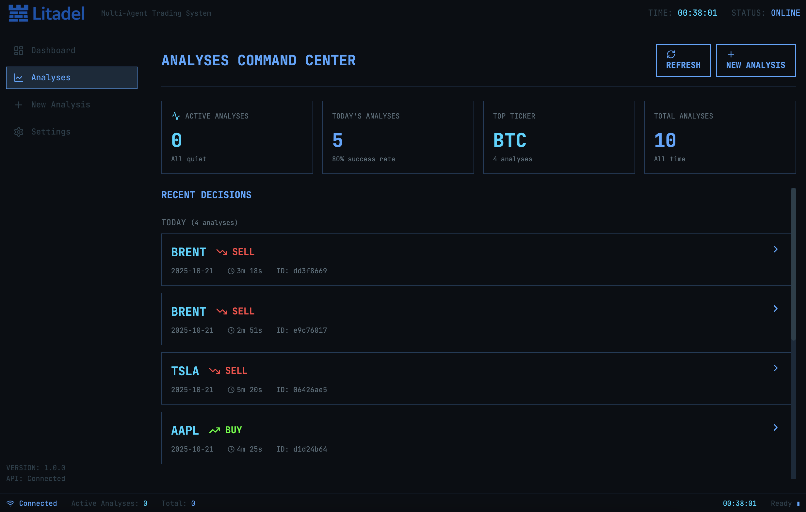
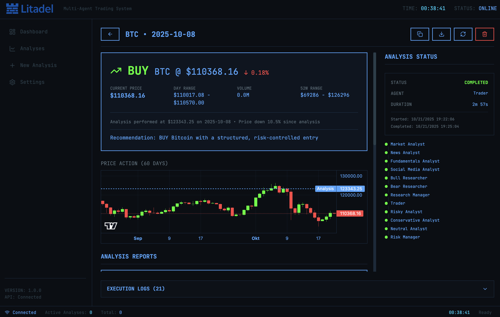
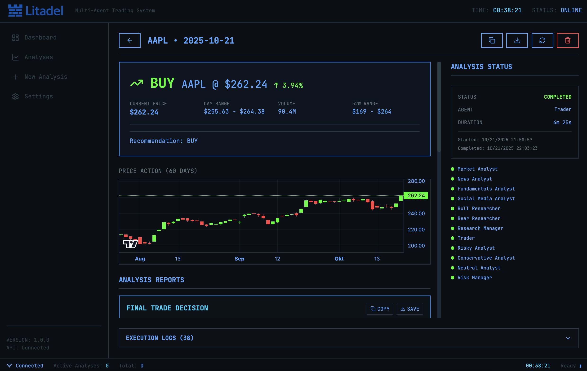
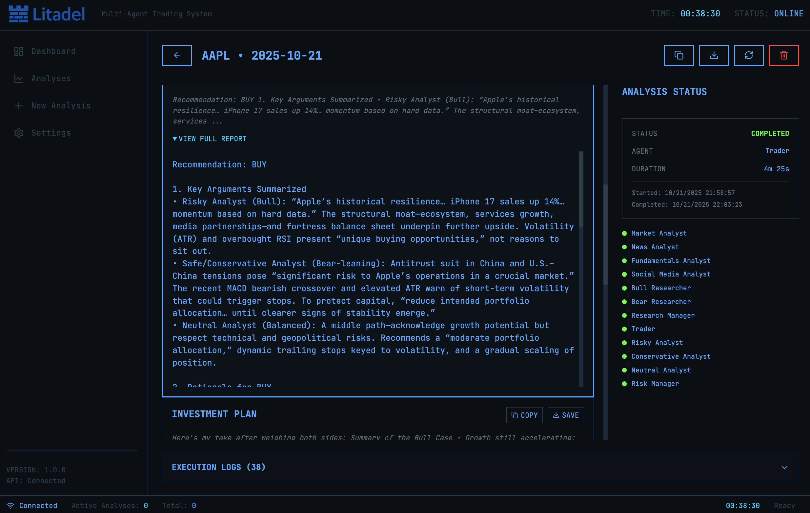

<p align="center">
  
</p>

---

# Litadel: Multi-Agents LLM Financial Trading Framework 

> **Copyright Notice:** Litadel is a successor of TradingAgents. This project builds upon and extends the original TradingAgents framework.

<div align="center">

🚀 [Overview](#overview) | 💻 [Dashboard](#dashboard) | ⚡ [Getting Started](#getting-started) | 🎯 [Usage](#usage) | 🤖 [How It Works](#how-it-works) | 🤝 [Contributing](#contributing) | 📄 [Citation](#citation)

</div>

## Overview

Litadel is a comprehensive AI-powered trading analysis platform that delivers professional-grade market insights across **equities, commodities, and cryptocurrencies**. Get actionable BUY/SELL/HOLD recommendations backed by multi-agent analysis covering fundamentals, technicals, news sentiment, and risk assessment.

> Litadel framework is designed for research and educational purposes. Trading performance may vary based on many factors. [It is not intended as financial, investment, or trading advice.](https://tauric.ai/disclaimer/)

### What You Get

**Three Ways to Analyze:**
- 🌐 **Web Dashboard** - Modern, real-time interface with live tracking, interactive charts, and comprehensive reports
- 💻 **Interactive CLI** - Rich terminal experience with live agent progress and automatic report generation
- 📦 **Python Package** - Integrate multi-agent analysis directly into your own applications

**Multi-Asset Coverage:**
- 📈 **Equities** - Full fundamental, technical, and sentiment analysis for stocks
- 🛢️ **Commodities** - Specialized analysis for oil, metals, agricultural products, and more
- ₿ **Cryptocurrencies** - Real-time crypto market analysis with sentiment tracking

**Professional Analysis:**
- Real-time market data with automatic caching
- Multi-perspective analysis with bull vs. bear debates
- Comprehensive reports covering all aspects of market conditions
- Clear trading recommendations with confidence scores

## Dashboard

### Your Trading Command Center

The web dashboard provides a complete control center for managing your trading analyses with real-time monitoring, interactive visualizations, and comprehensive reporting.

<p align="center">
  
</p>

### Analysis Management

Browse all your analyses with smart filtering and grouping. Track active analyses in real-time and review historical decisions with detailed statistics.

<p align="center">
  
</p>

### Real-Time Analysis Tracking

Watch your analysis unfold in real-time as AI agents collaborate to evaluate market conditions. See live progress updates, agent pipeline status, and streaming reports as they're generated.

<p align="center">
  
</p>

### Comprehensive Analysis Reports

Each completed analysis provides detailed insights with:
- **Trading Decision** - Clear BUY/SELL/HOLD recommendation with confidence score
- **Interactive Price Charts** - Candlestick charts with analysis date markers and 60-day history
- **Market Metrics** - Current price, daily change, volume, and 52-week ranges
- **Specialist Reports** - Detailed analysis from market, news, sentiment, and fundamental perspectives
- **Research Debate** - Bull vs. bear perspectives with investment recommendations
- **Risk Assessment** - Comprehensive risk evaluation and portfolio impact analysis

<p align="center">
  
</p>

<p align="center">
  
</p>

### Key Features

- **Real-Time WebSocket Updates** - Live progress tracking without page refreshes
- **Interactive Charts** - Visualize price action with candlestick or line charts
- **Export Capabilities** - Download complete analysis data as JSON
- **Analysis History** - Browse and compare past analyses by ticker and date
- **Secure API Access** - API key authentication with configurable endpoints
- **Responsive Design** - Works seamlessly on desktop and tablet devices

## Getting Started

### Installation

Clone Litadel:
```bash
git clone https://github.com/deepweather/Litadel.git
cd Litadel
```

Create a virtual environment:
```bash
conda create -n litadel python=3.13
conda activate litadel
```

Install dependencies:
```bash
pip install -r requirements.txt
```

### API Keys Setup

You will need API keys for LLM providers and market data. The default configuration uses OpenAI for agents and [Alpha Vantage](https://www.alphavantage.co/support/#api-key) for market data.

Create a `.env` file in the project root:
```bash
cp .env.example .env
# Edit .env with your actual API keys
```

Or export them directly:
```bash
export OPENAI_API_KEY=$YOUR_OPENAI_API_KEY
export ALPHA_VANTAGE_API_KEY=$YOUR_ALPHA_VANTAGE_API_KEY
```

**Note:** Litadel partners with Alpha Vantage to provide robust API support. Get a free API key [here](https://www.alphavantage.co/support/#api-key)—Litadel users receive increased rate limits (60 requests/minute, no daily limits) through Alpha Vantage's open-source support program.

## Usage

### Web Dashboard (Recommended)

The web interface provides the most comprehensive experience with real-time tracking, interactive charts, and complete analysis history.

**1. Start the API Server:**
```bash
python -m api.main
```

On first run, the system will automatically create a database and generate an API key. **Save this key—you'll need it for the web interface.**

**2. Start the Frontend:**
```bash
cd frontend
npm install
npm run dev
```

**3. Access the Dashboard:**

Open your browser to `http://localhost:5173` and enter your API key in Settings. You're ready to create your first analysis!

### Interactive CLI

For a terminal-based experience with live agent progress tracking:

```bash
python -m cli.main
```

Select your ticker, analysis date, analyst team, LLM models, and research depth through the interactive prompts.

<p align="center">
  
</p>

Watch as agents collaborate in real-time, with live updates showing their reasoning and tool usage:

<p align="center">
  
</p>

<p align="center">
  
</p>

Results are automatically saved to `results/<TICKER>/<DATE>/` with detailed logs and markdown reports.

### Python Package

Integrate Litadel's multi-agent analysis directly into your own applications, trading bots, or research pipelines.

**Basic Usage:**

```python
from tradingagents.graph.trading_graph import TradingAgentsGraph
from tradingagents.default_config import DEFAULT_CONFIG

# Initialize the trading agents
ta = TradingAgentsGraph(debug=True, config=DEFAULT_CONFIG.copy())

# Run analysis and get trading decision
_, decision = ta.propagate("NVDA", "2024-05-10")
print(decision)
```

**Custom Configuration:**

Customize LLM models, debate rounds, and data sources to match your needs:

```python
from tradingagents.graph.trading_graph import TradingAgentsGraph
from tradingagents.default_config import DEFAULT_CONFIG

# Create custom configuration
config = DEFAULT_CONFIG.copy()
config["deep_think_llm"] = "o1-mini"           # Deep reasoning model
config["quick_think_llm"] = "gpt-4o-mini"      # Fast operations model
config["max_debate_rounds"] = 3                # More thorough research debates

# Configure data sources
config["data_vendors"] = {
    "core_stock_apis": "yfinance",             # Price data
    "technical_indicators": "yfinance",        # Technical analysis
    "fundamental_data": "alpha_vantage",       # Company fundamentals
    "news_data": "alpha_vantage",              # News and sentiment
}

# Run with custom config
ta = TradingAgentsGraph(debug=True, config=config)
_, decision = ta.propagate("AAPL", "2024-05-10")
```

**Cost Optimization:**

For testing and development, we recommend using `gpt-4o-mini` and `o1-mini` to minimize costs, as the multi-agent framework makes numerous API calls during analysis. For production use with higher accuracy requirements, consider `gpt-4o` and `o1-preview`.

**Data Sources:**

The default configuration uses YFinance for price/technical data and Alpha Vantage for fundamentals/news. You can switch to OpenAI for web-based data fetching or use local cached data for offline experimentation. See `tradingagents/default_config.py` for all available options.

## How It Works

Litadel uses a multi-agent architecture that mirrors the structure of professional trading firms. Specialized AI agents collaborate to provide comprehensive market analysis.

<p align="center">
  
</p>

### Analyst Team

Four specialized analysts evaluate different aspects of market conditions:

- **Technical Analyst** - Analyzes price patterns, trends, and technical indicators (MACD, RSI, moving averages)
- **Fundamentals Analyst** - Evaluates company financials, earnings, balance sheets, and intrinsic value
- **News Analyst** - Monitors global news, macroeconomic indicators, and their market impact
- **Sentiment Analyst** - Analyzes social media and public sentiment to gauge market mood

<p align="center">
  
</p>

### Researcher Team

Bull and bear researchers critically assess analyst insights through structured debates, balancing potential gains against risks.

<p align="center">
  
</p>

### Trader Agent

Synthesizes all reports and research to make informed trading decisions with clear timing and position sizing recommendations.

<p align="center">
  
</p>

### Risk Management and Portfolio Manager

Evaluates portfolio risk by assessing market volatility, liquidity, and other risk factors. The risk team provides final assessment and approval for trading decisions.

<p align="center">
  
</p>

## What's New in Litadel

### Completed Features
- ✅ **Web Dashboard** - Full-featured web interface with real-time analysis tracking
- ✅ **REST API** - Complete API for programmatic access with WebSocket support
- ✅ **Multi-Asset Support** - Equities, commodities, and cryptocurrencies
- ✅ **Interactive Charts** - Real-time candlestick and line charts with market data
- ✅ **Analysis History** - Persistent storage and browsing of all analyses
- ✅ **Export Capabilities** - Download complete analysis data as JSON

### Roadmap
- 🚧 **Automated Trading Mode** - Continuous automated trading execution
- 🚧 **Portfolio Management** - Multi-asset portfolio tracking and optimization
- 🚧 **Backtesting Engine** - Historical performance analysis with TauricDB
- 🚧 **OpenAI Agents SDK Migration** - Enhanced parallelization and maintainability

## Contributing

We welcome contributions from the community! Whether it's fixing a bug, improving documentation, or suggesting a new feature, your input helps make this project better.

## Citation

Please reference our work if you find *Litadel* provides you with some help :)

Litadel citation:

```
@software{gabler2025litadel,
      title={Litadel: Multi-Agents LLM Financial Trading Framework}, 
      author={Marvin Gabler},
      year={2025},
      url={https://github.com/deepweather/Litadel},
      note={Extended framework based on TradingAgents}
}
```

Original TradingAgents citation:

```
@misc{xiao2025tradingagentsmultiagentsllmfinancial,
      title={TradingAgents: Multi-Agents LLM Financial Trading Framework}, 
      author={Yijia Xiao and Edward Sun and Di Luo and Wei Wang},
      year={2025},
      eprint={2412.20138},
      archivePrefix={arXiv},
      primaryClass={q-fin.TR},
      url={https://arxiv.org/abs/2412.20138}, 
}
```
