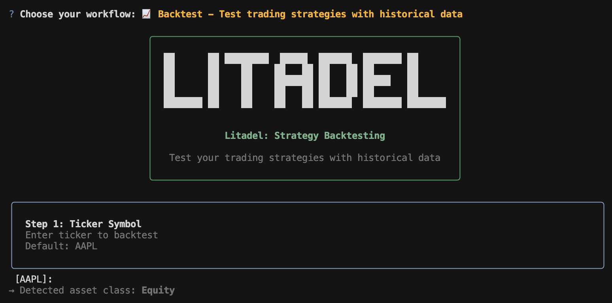

<p align="center">
  
</p>

---

> **Copyright Notice:** Litadel is a successor of TradingAgents by TaurusResearch. This project builds upon and extends the original TradingAgents framework.

# Litadel: AI-Native Hedge Fund Platform

> *Citadel was built by quants. Litadel was built by vibes.* 🚀

> **About Litadel:** Built on the foundation of TradingAgents, Litadel is an AI-native hedge fund platform that combines deep market analysis, automated strategy generation, and rigorous backtesting. While TradingAgents provided an excellent proof-of-concept for multi-agent trading analysis, Litadel extends it into a complete trading system with: multi-asset support (stocks, crypto & commodities), AI-powered strategy code generation, secure backtesting engine, modern web interface, parallel execution, persistent storage, REST API, and portfolio management. From research to execution, Litadel handles the entire trading workflow.

<div align="center">

🚀 [Overview](#overview) | 💻 [Dashboard](#dashboard) | ⚡ [Getting Started](#getting-started) | 🎯 [Usage](#usage) | 📊 [Backtesting](#backtesting) | 🤖 [How It Works](#how-it-works) | 📄 [Citation](#citation)

</div>

## Overview

Litadel is an AI-native hedge fund platform that delivers the complete trading workflow: from deep market research to strategy generation to rigorous backtesting. Get actionable BUY/SELL/HOLD recommendations backed by multi-agent analysis across **equities, commodities, and cryptocurrencies**, generate trading strategies from natural language, and validate them with historical data before deployment.

> Litadel framework is designed for research and educational purposes. Trading performance may vary based on many factors. [It is not intended as financial, investment, or trading advice.](https://tauric.ai/disclaimer/)

### What You Get

**Complete Trading Workflow:**
- 🔍 **Market Research** - Multi-agent analysis with fundamentals, technicals, news, and sentiment
- 🤖 **Strategy Generation** - AI creates executable Python trading strategies from natural language
- 📊 **Backtesting** - Validate strategies with historical data, risk metrics, and performance charts
- 💼 **Portfolio Management** - Track positions, analyze performance, and manage your investments

**Three Ways to Use Litadel:**
- 🌐 **Web Dashboard** - Full-featured interface with real-time tracking, professional charts, and complete workflow management
- 💻 **Interactive CLI** - Rich terminal experience with live progress, arrow-key navigation, and automatic report generation
- 📦 **Python Package** - Integrate analysis, backtesting, and trading logic directly into your own applications

**Multi-Asset Coverage:**
- 📈 **Equities** - Full fundamental, technical, and sentiment analysis for stocks
- 🛢️ **Commodities** - Specialized analysis for oil, metals, agricultural products
- ₿ **Cryptocurrencies** - Crypto market analysis with fractional share support (μBTC/μETH)

## Dashboard

### Your Trading Command Center

The web dashboard provides a complete control center for managing analyses, backtests, and portfolios with real-time monitoring, interactive visualizations, and comprehensive reporting.

<p align="center">
  
</p>

### Real-Time Analysis Tracking

Watch your analysis unfold in real-time as AI agents collaborate to evaluate market conditions. Each analysis provides:

- **Trading Decision** - Clear BUY/SELL/HOLD recommendation with confidence score
- **Interactive Price Charts** - Candlestick charts with analysis date markers and 60-day history
- **Market Metrics** - Current price, daily change, volume, and 52-week ranges
- **Specialist Reports** - Detailed analysis from market, news, sentiment, and fundamental perspectives
- **Research Debate** - Bull vs. bear perspectives with investment recommendations
- **Risk Assessment** - Comprehensive risk evaluation and portfolio impact analysis

<p align="center">
  
</p>

Monitor execution logs and agent reasoning in real-time:

<p align="center">
  
</p>

### Key Features

- **Real-Time WebSocket Updates** - Live progress tracking without page refreshes
- **Interactive Charts** - Visualize price action with candlestick or line charts
- **Export Capabilities** - Download complete analysis data as JSON
- **Analysis History** - Browse and compare past analyses by ticker and date
- **Secure API Access** - API key authentication with configurable endpoints
- **Responsive Design** - Works seamlessly on desktop and tablet devices

## Getting Started

### Installation

Clone Litadel:
```bash
git clone https://github.com/deepweather/Litadel.git
cd Litadel
```

Create a virtual environment:
```bash
conda create -n litadel python=3.13
conda activate litadel
```

Install dependencies:
```bash
pip install -r requirements.txt
```

### API Keys Setup

You will need API keys for LLM providers and market data. The default configuration uses OpenAI for agents and [Alpha Vantage](https://www.alphavantage.co/support/#api-key) for market data.

Create a `.env` file in the project root:
```bash
cp .env.example .env
# Edit .env with your actual API keys
```

Or export them directly:
```bash
export OPENAI_API_KEY=$YOUR_OPENAI_API_KEY
export ALPHA_VANTAGE_API_KEY=$YOUR_ALPHA_VANTAGE_API_KEY
```

**Note:** Litadel partners with Alpha Vantage to provide robust API support. Get a free API key [here](https://www.alphavantage.co/support/#api-key)—Litadel users receive increased rate limits (60 requests/minute, no daily limits) through Alpha Vantage's open-source support program.

## Usage

### Web Dashboard (Recommended)

The web interface provides the most comprehensive experience with real-time tracking, interactive charts, and complete analysis history.

**1. Start the API Server:**
```bash
python -m api.main
```

On first run, the system will automatically create a database and generate an API key. **Save this key—you'll need it for the web interface.**

**2. Start the Frontend:**
```bash
cd frontend
npm install
npm run dev
```

**3. Access the Dashboard:**

Open your browser to `http://localhost:5173` and enter your API key in Settings. You're ready to create your first analysis!

### Interactive CLI

For a terminal-based experience with live progress tracking and arrow-key navigation:

```bash
# Launch interactive menu
litadel-cli

# Or run directly
litadel-cli analyze    # Deep dive market analysis
litadel-cli backtest   # Strategy backtesting
```

The Litadel CLI provides a rich, interactive terminal interface with:
- **Arrow-key navigation** for all menus and selections
- **Step-by-step workflows** for analysis and backtesting
- **Live agent progress** showing reasoning and tool usage in real-time
- **Syntax-highlighted code** for generated strategies
- **Formatted results** with colors and panels

<p align="center">
  
</p>

**Analysis Workflow:**
1. Select ticker and date
2. Choose analyst team
3. Configure LLM models
4. Watch agents collaborate
5. Get trading recommendation

**Backtest Workflow:**
1. Enter ticker and date range
2. Describe strategy in plain English
3. AI generates Python code
4. Docker sandbox validates (auto-fixes errors)
5. Run backtest
6. See performance metrics and profit/loss

Results are automatically saved to `results/<TICKER>/<DATE>/` with detailed logs and markdown reports.

### Python Package

Integrate Litadel's multi-agent analysis directly into your own applications, trading bots, or research pipelines.

**Basic Usage:**

```python
from litadel.graph.trading_graph import TradingAgentsGraph
from litadel.default_config import DEFAULT_CONFIG

# Initialize the trading agents
litadel = TradingAgentsGraph(debug=True, config=DEFAULT_CONFIG.copy())

# Run analysis and get trading decision
_, decision = litadel.propagate("NVDA", "2024-05-10")
print(decision)
```

**Custom Configuration:**

Customize LLM models, debate rounds, and data sources to match your needs:

```python
from litadel.graph.trading_graph import TradingAgentsGraph
from litadel.default_config import DEFAULT_CONFIG

# Create custom configuration
config = DEFAULT_CONFIG.copy()
config["deep_think_llm"] = "o1-mini"           # Deep reasoning model
config["quick_think_llm"] = "gpt-4o-mini"      # Fast operations model
config["max_debate_rounds"] = 3                # More thorough research debates

# Configure data sources
config["data_vendors"] = {
    "core_stock_apis": "yfinance",             # Price data
    "technical_indicators": "yfinance",        # Technical analysis
    "fundamental_data": "alpha_vantage",       # Company fundamentals
    "news_data": "alpha_vantage",              # News and sentiment
}

# Run with custom config
litadel = TradingAgentsGraph(debug=True, config=config)
_, decision = litadel.propagate("AAPL", "2024-05-10")
```

**Cost Optimization:**

For testing and development, we recommend using `gpt-4o-mini` and `o1-mini` to minimize costs, as the multi-agent framework makes numerous API calls during analysis. For production use with higher accuracy requirements, consider `gpt-4o` and `o1-preview`.

**Data Sources:**

The default configuration uses YFinance for price/technical data and Alpha Vantage for fundamentals/news. You can switch to OpenAI for web-based data fetching or use local cached data for offline experimentation. See `litadel/default_config.py` for all available options.

## Backtesting

Test your trading strategies with historical data before risking real capital. Litadel's backtesting engine combines AI-powered strategy generation with professional-grade backtesting capabilities.

### Features

**AI Strategy Generation:**
- Describe your strategy in plain English
- LLM generates executable Python code using backtesting.py library
- Automatic validation in Docker sandbox (secure, isolated)
- Self-healing: Auto-fixes common errors (missing imports, syntax issues)

<p align="center">
  
</p>

**Professional Backtesting:**
- Historical data from 2010+ for stocks, 2015+ for crypto
- Realistic commission and slippage modeling
- Fractional share support for crypto (μBTC/μETH conversion)
- Both entry (BUY) and exit (SELL) trades tracked

**Comprehensive Metrics:**
- **Returns:** Total return %, profit/loss in dollars, vs. buy-and-hold
- **Risk:** Sharpe ratio, max drawdown, volatility
- **Trading:** Win rate, profit factor, average trade duration
- **Exposure:** Time in market, number of trades

**Professional Charts:**
- Equity curve with baseline
- Drawdown over time
- Cumulative P&L
- Win/loss distribution

<p align="center">
  
</p>

### Quick Start

**Web UI:**

Create and execute backtests with an intuitive step-by-step interface:

<p align="center">
  
</p>

1. Navigate to Strategies → Create Backtest
2. Describe strategy: "Buy when RSI < 30, sell when RSI > 70"
3. AI generates code → Auto-validates → Create
4. Strategy validates in background (WebSocket updates)
5. Click Execute → See results with charts

View detailed results with professional charts and comprehensive metrics:

<p align="center">
  
</p>

**CLI:**
```bash
litadel-cli backtest

# Follow prompts:
# - Ticker: BTC
# - Dates: 2023-01-01 to 2023-12-31
# - Strategy: "SMA crossover strategy"
# - Capital: 50000
# - Commission: 0.002
```

**Python API:**
```python
from litadel.backtest import BacktestConfig, BacktestEngine

config = BacktestConfig(
    symbol="AAPL",
    start_date="2023-01-01",
    end_date="2023-12-31",
    strategy_class_code="""
from backtesting import Strategy
from backtesting.lib import crossover
from backtesting.test import SMA

class SmaCross(Strategy):
    n1 = 10
    n2 = 20

    def init(self):
        self.sma1 = self.I(SMA, self.data.Close, self.n1)
        self.sma2 = self.I(SMA, self.data.Close, self.n2)

    def next(self):
        if crossover(self.sma1, self.sma2):
            if not self.position:
                self.buy()
        elif crossover(self.sma2, self.sma1):
            if self.position:
                self.position.close()
""",
    initial_capital=100000,
    commission=0.002,
)

engine = BacktestEngine()
result = engine.execute(config)

print(f"Return: {result.total_return_pct:.2f}%")
print(f"Sharpe: {result.sharpe_ratio:.2f}")
print(f"Trades: {result.num_trades}")
```

### Current Limitations

- **Single-ticker only** - Multi-ticker portfolio strategies coming soon
- **No live trading** - Backtests only (live execution in development)
- **Docker required** - For secure strategy validation (falls back to basic checks if unavailable)

## How It Works

Litadel uses a multi-agent architecture that mirrors the structure of professional trading firms. Specialized AI agents collaborate to provide comprehensive market analysis.

<p align="center">
  
</p>

### Analyst Team

Four specialized analysts evaluate different aspects of market conditions:

- **Technical Analyst** - Analyzes price patterns, trends, and technical indicators (MACD, RSI, moving averages)
- **Fundamentals Analyst** - Evaluates company financials, earnings, balance sheets, and intrinsic value
- **News Analyst** - Monitors global news, macroeconomic indicators, and their market impact
- **Sentiment Analyst** - Analyzes social media and public sentiment to gauge market mood

<p align="center">
  
</p>

### Researcher Team

Bull and bear researchers critically assess analyst insights through structured debates, balancing potential gains against risks.

<p align="center">
  
</p>

### Trader Agent

Synthesizes all reports and research to make informed trading decisions with clear timing and position sizing recommendations.

<p align="center">
  
</p>

### Risk Management and Portfolio Manager

Evaluates portfolio risk by assessing market volatility, liquidity, and other risk factors. The risk team provides final assessment and approval for trading decisions.

<p align="center">
  
</p>

## What's New in Litadel

### Completed Features

**Core Platform:**
- ✅ **Web Dashboard** - Full-featured interface with real-time tracking and professional charts
- ✅ **REST API** - Complete API for programmatic access with WebSocket support
- ✅ **Interactive CLI** - Arrow-key navigation with rich terminal UI
- ✅ **Multi-Asset Support** - Equities, commodities, and cryptocurrencies

**Market Analysis:**
- ✅ **Multi-Agent Analysis** - 4 specialist analysts + research team + risk management
- ✅ **Real-Time Tracking** - WebSocket-based live updates
- ✅ **Analysis History** - Persistent storage and browsing of all analyses
- ✅ **Interactive Charts** - Professional candlestick and line charts
- ✅ **Export Capabilities** - Download complete analysis data as JSON

**Strategy & Backtesting:**
- ✅ **AI Strategy Generation** - Generate Python trading strategies from natural language descriptions
- ✅ **Docker Sandbox Validation** - Secure code execution and automatic error fixing (self-healing)
- ✅ **Historical Backtesting** - Test strategies with real market data
- ✅ **Performance Metrics** - Sharpe ratio, drawdown, win rate, profit factor, and more
- ✅ **Professional Charts** - Equity curve, drawdown, cumulative P&L, win/loss distribution
- ✅ **Crypto Support** - Fractional share trading (μBTC/μETH conversion)
- ✅ **Single-Ticker Backtests** - Validated execution with both BUY and SELL trades

### In Progress
- 🚧 **Portfolio Backtesting** - Multi-ticker strategies with rebalancing and position sizing
- 🚧 **Automated Trading Mode** - Continuous automated execution with live monitoring
- 🚧 **Portfolio Optimization** - Multi-asset portfolio tracking and optimization
- 🚧 **Strategy Library** - Save and reuse validated strategies

## Citation

Please reference our work if you find *Litadel* provides you with some help :)

Litadel citation:

```
@software{gabler2025litadel,
      title={Litadel: Multi-Agents LLM Financial Trading Framework},
      author={Marvin Gabler},
      year={2025},
      url={https://github.com/deepweather/Litadel},
      note={Extended framework based on TradingAgents}
}
```

Original TradingAgents citation:

```
@misc{xiao2025tradingagentsmultiagentsllmfinancial,
      title={TradingAgents: Multi-Agents LLM Financial Trading Framework},
      author={Yijia Xiao and Edward Sun and Di Luo and Wei Wang},
      year={2025},
      eprint={2412.20138},
      archivePrefix={arXiv},
      primaryClass={q-fin.TR},
      url={https://arxiv.org/abs/2412.20138},
}
```
